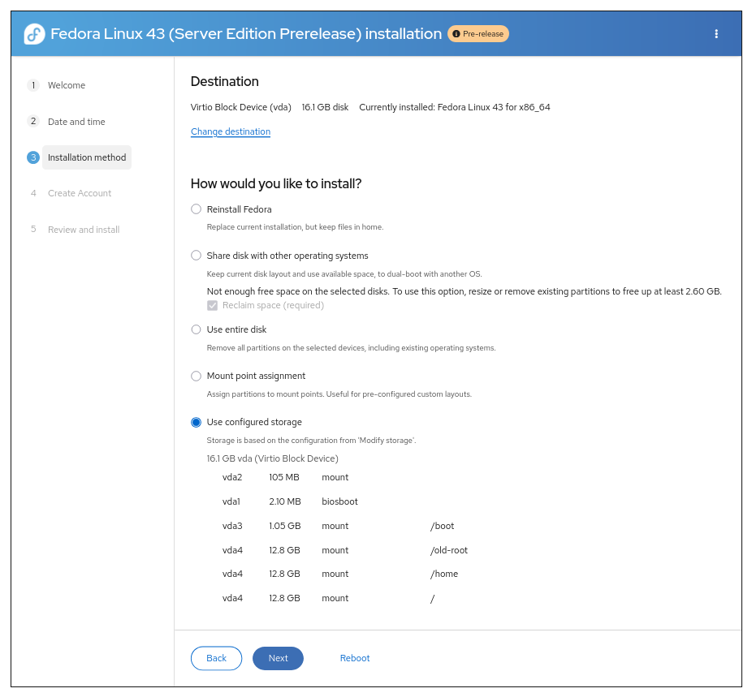

Installation Flow Overview
==========================

This document describes the step-by-step process for installing the system using the Web UI.

1. **Welcome**
2. **Date and time**
3. **Software selection**
4. **Installation method**
5. **Storage configuration**
6. **Create Account**
7. **Review and install**
8. **Installation progress**

Detailed Step Descriptions
=============================

1. Welcome
----------

Select the language & keyboard to use during installation and for the target system.

2. Date and time
----------------

Configure your system's timezone, date, and time settings. You can also set up network time synchronization.

3. Software selection
---------------------

Select packages to install by choosing a base environment.

4. Installation method
----------------------

Choose the target device(s) for the installation and the partitioning scenario.

Storage Partitioning Scenarios
^^^^^^^^^^^^^^^^^^^^^^^^^^^^^^

The Web UI installer provides several storage partitioning scenarios to accommodate different installation needs:

**Use entire disk**

Completely erases all data on the selected disks and automatically creates a new partition layout. Use this for clean installations when you do not need to preserve any existing data.

**Mount point assignment**

Allows you to manually assign mount points to specific devices for complete control over the partition layout. Use this if you have custom storage requirements or want to reuse existing partitions selectively.

.. figure:: images/storage-scenario-mount-point-mapping.png
   :width: 500px
   :alt: Mount point assignment scenario interface

**Reinstall Fedora**

Reinstalls Fedora while preserving your existing home directory and user data. Use when you want to refresh your Fedora installation while keeping all your personal files and settings. This option only appears when exactly one existing Fedora system is detected and the system has only the default mount points.

**Use configured storage**

Uses storage configuration created through the external Cockpit storage editor tool for non-default layouts. This option only appears when you have configured and confirmed a valid storage layout through cockpit-storage.

.. figure:: images/storage-scenario-use-configured-storage.png
   :width: 500px
   :alt: Use configured storage scenario interface

**Use free space**

Installs using only unallocated free space, preserving existing partitions and data. Use when you want to dual-boot with existing operating systems. This option only appears when existing partitions are detected on the selected disks.

5. Storage configuration
------------------------

Automatic partitioning configuration, disk encryption, and storage options.

6. Create Account
-----------------

Set up user accounts and administrator passwords for your system.

7. Review and install
---------------------

Review your installation settings and start the installation process.

8. Installation progress
------------------------

Monitor the installation progress and completion.

