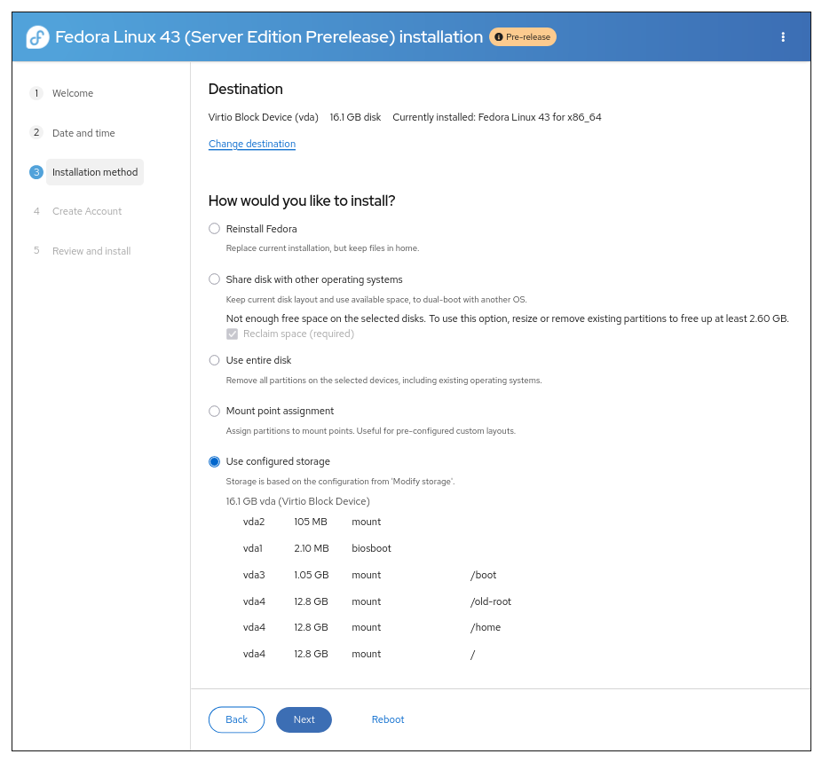
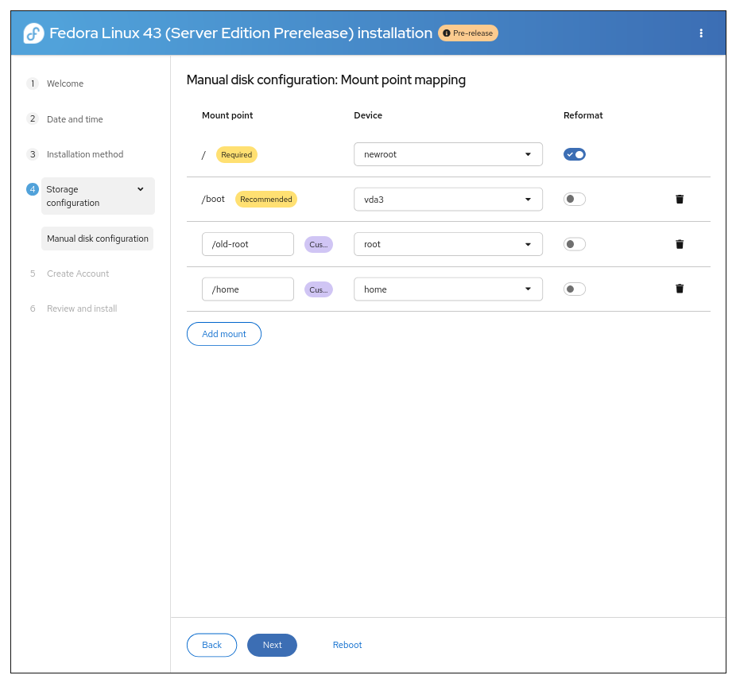
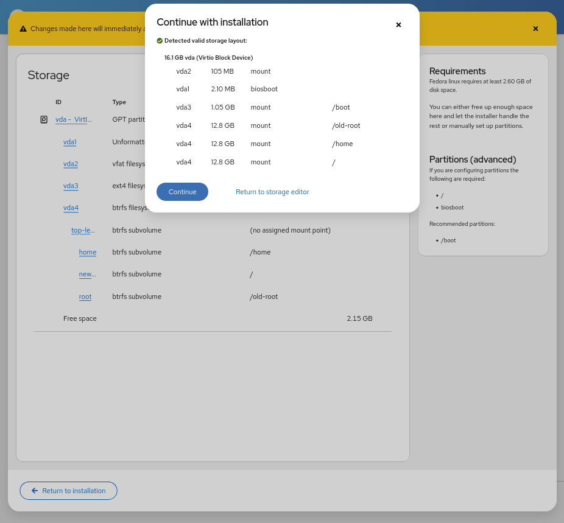

Storage Partitioning Scenarios
==============================

This document describes the available storage partitioning scenarios in
Anaconda Web UI. These options are designed to accommodate a variety of
installation needs, from clean installs to advanced custom layouts.

Note: This documentation is auto-generated from the source code.

.. _erase-all:

Erase All
---------

Completely erases all data on the selected disks and automatically creates a new partition layout. Use this for clean installations when you do not need to preserve any existing data.

.. _home-reuse:

Home Reuse
----------

Reinstalls Fedora while preserving your existing home directory and user data. Use when you want to refresh your Fedora installation while keeping all your personal files and settings. This option only appears when exactly one existing Fedora system is detected and the system has only the default mount points.

.. _mount-point-mapping:

Mount Point Mapping
-------------------

Allows you to manually assign mount points to specific devices for complete control over the partition layout. Use this if you have custom storage requirements or want to reuse existing partitions selectively.

.. _use-configured-storage:

Use Configured Storage
----------------------

Uses storage configuration created through the external Cockpit storage editor tool for non-default layouts. This option only appears when you have configured and confirmed a valid storage layout through cockpit-storage.

.. _use-free-space:

Use Free Space
--------------

Installs using only unallocated free space, preserving existing partitions and data. Use when you want to dual-boot with existing operating systems. This option only appears when existing partitions are detected on the selected disks.

